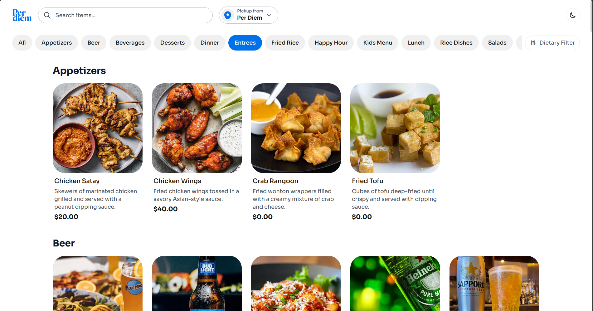
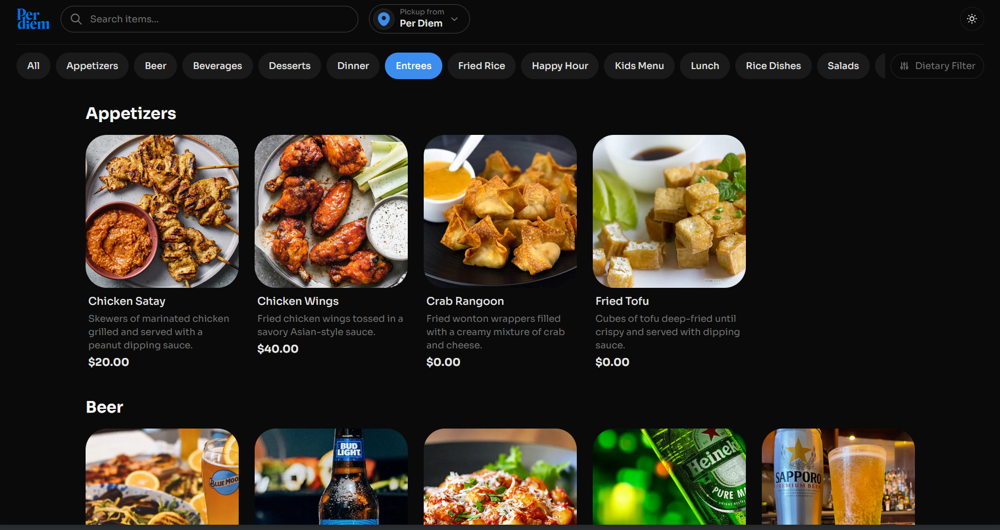
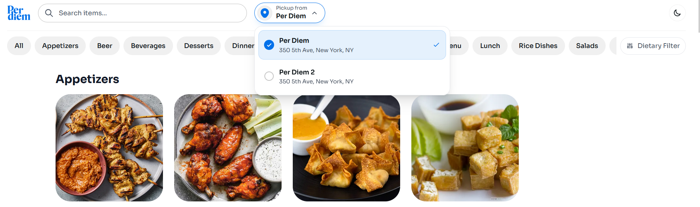
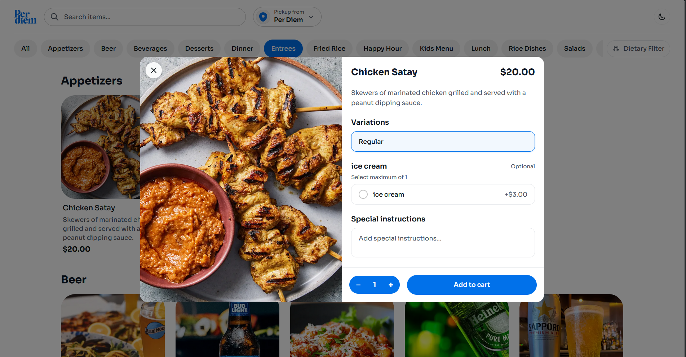
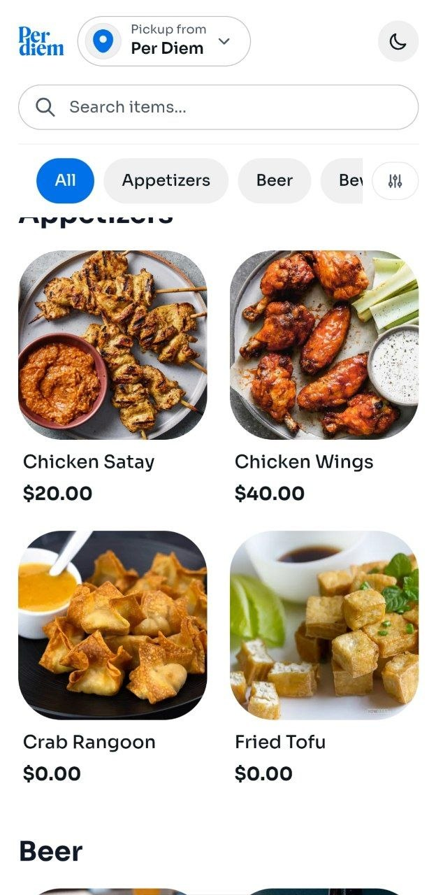
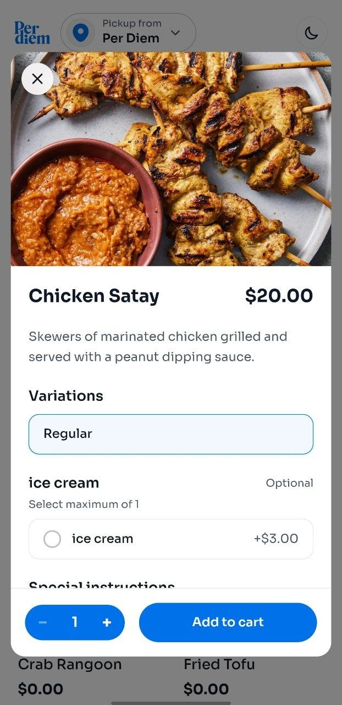

# Per Diem — Square Menu App

A full-stack restaurant menu web app that pulls from the Square Catalog API. Customers pick a location, browse the menu by category, and view item details with modifiers. Built mobile-first with Next.js 16.

## Demo

[Watch the walkthrough on Loom](https://www.loom.com/share/c2cc0706e4f44f61a8ed179435b163f2)

### Screenshots

| Light Mode | Dark Mode |
|:---:|:---:|
|  |  |

| Location Picker | Item Detail |
|:---:|:---:|
|  |  |

| Mobile UI | Mobile Item Detail |
|:---:|:---:|
|  |  |

## Getting Started

You'll need Node.js 20.9+, pnpm, a [Square Developer](https://developer.squareup.com) account, and an [Upstash Redis](https://console.upstash.com) database.

```bash
git clone https://github.com/bm-197/per_diem
cd per_diem
pnpm i
cp .env.example .env   # fill in your credentials
pnpm dev               # http://localhost:3000
```

Or with Docker:

```bash
docker-compose up                           # dev mode with hot reload
DOCKER_TARGET=prod docker-compose up --build # production build
```

## How It Works

The app is a Next.js backend proxy sitting between the browser and Square's API. The Square access token never leaves the server.

**Request flow:**

```
Browser → Next.js API Route → Redis Cache (hit?) → Square SDK → Transform → Cache → Response
```

When a request comes in, it checks Redis first. On a cache miss, it calls Square's `SearchCatalogObjects` with `includeRelatedObjects: true`, paginates through all results, joins category names and image URLs from the related objects, filters by location, pulls inventory counts, and assembles the response. That assembled result gets cached for 5 minutes.

I went with Upstash Redis instead of in-memory caching because this deploys to Vercel — serverless functions don't share memory between invocations, so an in-memory Map would be useless. Upstash is HTTP-based so it works the same locally, in Docker, and on Vercel.

### API Endpoints

| Endpoint | What it does |
|----------|-------------|
| `GET /api/locations` | Returns active Square locations |
| `GET /api/catalog?location_id=X` | Menu items grouped by category, with modifiers and availability |
| `GET /api/catalog/categories?location_id=X` | Category names with item counts |
| `POST /api/webhooks/square` | Receives `catalog.version.updated` webhooks to bust the cache |


## What's in the Frontend

The UI is built mobile-first (375px target) and scales up to desktop.

**Location picker** — A dropdown that expands from the header button. Pick a location and the menu reloads. Choice persists in localStorage.

**Category navigation** — Horizontal scrollable pills. Clicking one smooth-scrolls to that section (doesn't filter — all sections stay visible).

**Menu items** — 2-column grid on mobile (no descriptions, 34px rounded images), 4-5 columns on desktop (3-line clamped descriptions, 8px rounded images).

**Item detail modal** — Opens when you click any item. Image on the left, details on the right (stacked on mobile). Shows variations, modifiers (interactive — you can toggle them), special instructions field, quantity controls.


**Featured section** — Horizontal cards at the top showing one item from each category.

**Search** — Client-side filtering across item names and descriptions. Debounced at 300ms.

**Dietary filters** — Modal with allergen exclusions and dietary preference inclusions. Client-side filtering.

**Dark mode** — Toggle in the header. Uses `next-themes` with the `.dark` class strategy. Persists to localStorage, respects system preference.

**Loading states** — Shimmer skeleton animations while data loads. Error states with retry buttons. Empty states when a location has no items.

## Project Structure

```
app/
  api/
    locations/route.ts        # GET — list active locations
    catalog/route.ts          # GET — menu items by location
    catalog/categories/route.ts
    webhooks/square/route.ts  # POST — cache invalidation
  layout.tsx                  # Root layout, Sora font, ThemeProvider
  page.tsx                    # Renders MenuContent
  globals.css                 # Design tokens, animations, dark mode

components/
  MenuContent.tsx             # Orchestrates all state and data fetching
  Header.tsx                  # Logo, search, location picker, theme toggle
  LocationSelector.tsx        # Dynamic Island dropdown
  CategoryNav.tsx             # Scrollable category pills
  MenuSection.tsx             # Category heading + item grid
  MenuItemCard.tsx            # Item card with availability badges
  ItemDetailModal.tsx         # Full item detail with modifiers
  FeaturedSection.tsx         # Horizontal featured cards
  DietaryFilterModal.tsx      # Allergen/dietary preference filters
  SearchBar.tsx               # Debounced search input
  ThemeToggle.tsx             # Dark/light mode switch
  LoadingSkeleton.tsx         # Shimmer loading placeholders
  ErrorState.tsx              # Error message + retry
  EmptyState.tsx              # No items message

lib/
  types.ts                    # All shared TypeScript interfaces
  square.ts                   # Square SDK singleton
  square-service.ts           # Business logic — fetch, paginate, cache
  square-transformers.ts      # Raw Square data → app types
  cache.ts                    # Upstash Redis get/set/invalidate
  errors.ts                   # Square error → API error mapping
  api-utils.ts                # Request logging wrapper
  utils.ts                    # Price formatting, text truncation
  hooks/                      # useLocations, useCatalog, useCategories, useSearch

proxy.ts                      # Next.js 16 request logging (replaces middleware)
Dockerfile                    # Multi-stage: dev (hot reload) + prod (standalone)
docker-compose.yml
```

## Testing

```bash
pnpm test          # watch mode
pnpm test:run      # single run
pnpm test:coverage # with coverage
```

Tests cover:
- Price formatting, text truncation, BigInt serialization
- Redis cache operations (mocked)
- Square data transformers — location filtering, category grouping, image/modifier resolution, BigInt price conversion
- Component rendering — CategoryNav, MenuItemCard, LocationSelector
- API route handlers — success paths, error mapping, missing parameter validation

## Accessibility

- Focus-visible outlines on all interactive elements
- `role="dialog"` and `aria-modal` on all modals
- `role="tablist"` / `role="tab"` / `aria-selected` on category navigation
- `role="listbox"` / `role="option"` / `aria-selected` on location picker
- `aria-expanded` and `aria-haspopup` on dropdown triggers
- `aria-live="polite"` on dynamic content regions (loading states, availability badges)
- `aria-hidden="true"` on decorative SVGs
- `aria-label` on icon-only buttons
- Keyboard navigation — Tab, Escape to close, Enter/Space to activate


## Environment Variables

| Variable | Required | Description |
|----------|----------|-------------|
| `SQUARE_ACCESS_TOKEN` | Yes | Square sandbox or production access token |
| `SQUARE_ENVIRONMENT` | Yes | `sandbox` or `production` |
| `SQUARE_WEBHOOK_SIGNATURE_KEY` | No | For webhook signature verification |
| `UPSTASH_REDIS_REST_URL` | Yes | Upstash Redis REST endpoint |
| `UPSTASH_REDIS_REST_TOKEN` | Yes | Upstash Redis REST token |

## Tech Stack

- **Next.js 16** (App Router) — framework
- **TypeScript** (strict mode) — language
- **Tailwind CSS v4** — styling
- **Square SDK** (`square` npm) — catalog, locations, inventory APIs
- **Upstash Redis** (`@upstash/redis`) — server-side caching
- **next-themes** — dark mode
- **Vitest + React Testing Library** — testing
- **pnpm** — package manager
- **Docker** — containerization
